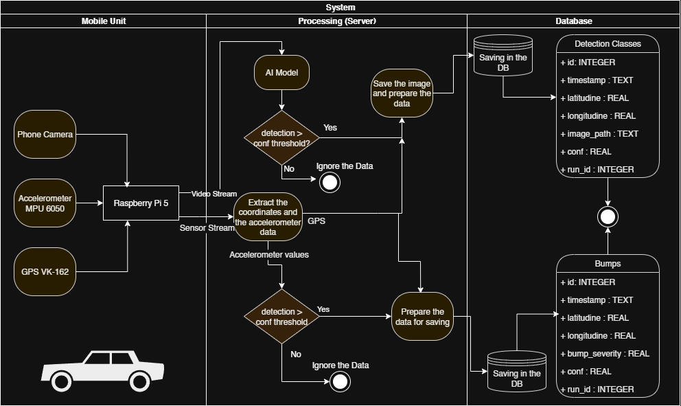

# Pothole-App – Automated Road Defect Detection & Mapping System

An automated system for real-time detection and mapping of road surface defects using AI and embedded sensors.

📽️ [Live Car Demo](https://www.youtube.com/watch?v=4mA1ID8_2bQ&ab_channel=TudorFrecus)
📽️ [Website Demo](https://www.youtube.com/watch?v=DPcOtM4nTKA&ab_channel=TudorFrecus)

## 📚 Description

**Pothole-App** is a hybrid software-hardware system developed to automatically detect  
 and geolocate road defects such as potholes and cracks. It combines real-time video and sensor data   
 from a mobile acquisition unit with deep learning models to analyze and visualize defects  
  on an interactive web dashboard.

Originally developed as a diploma project at the Politehnica University of Bucharest,  
 the system aims to improve road infrastructure monitoring by:
- Reducing human effort and response time.
- Enhancing the safety of drivers and pedestrians.
- Offering transparency and public participation.

## 🧠 Features

- 📸 Real-time video analysis using YOLOv11
- 📍 Accurate GPS-based geolocation (VK-162 GPS module)
- 📈 Bumps detection with MPU6050 accelerometer
- 🌍 Interactive web map (Leaflet.js + OpenStreetMap)
- 🧑‍💼 Admin dashboard for defect validation and statistics
- 📢 Citizen interface to report road issues
- 🔒 User authentication with secure password storage

## 🛠️ Technologies Used

### Embedded Hardware
- **Raspberry Pi 5**
- **MPU6050** (Accelerometer + Gyroscope)
- **VK-162** (USB GPS module)
- **Android phone** (IP camera stream via Wi-Fi)

### Software Stack
- **Python**, **OpenCV**, **Flask**
- **YOLOv11** (custom trained model for pothole/crack detection)
- **SQLite** (lightweight database)
- **HTML/CSS/JavaScript**
- **Leaflet.js**, **Bootstrap**, **Chart.js**

## ⚙️ System Architecture

---

## 🔒 Security & Auth

- 🔐 User authentication using Flask-JWT and bcrypt
- 🧾 Reports validated by AI + human review

## 📈 Future Improvements
- Improve the model to support multi-angle camera inputs or LIDAR
- Add detection for missing road signs and lane markings
- Improve AI robustness under poor lighting and weather conditions
- Implement automatic notifications to local authorities
- Integrate with national or municipal infrastructure systems
